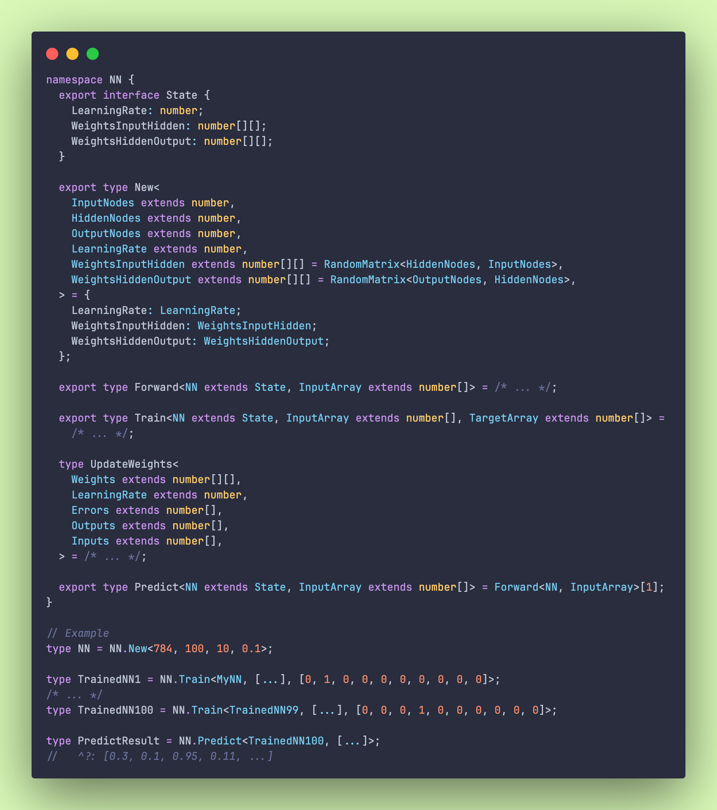

# ts-type-level-nn

A neural network sample (actually a Multilayer Perceptron, MLP) written in pure type-level TypeScript, just for fun!

This screenshot shows the original training trajectory. See `src/main.ts` for the current implementation.

## Development

Use Node.js 22.18 or newer on the 22.x LTS line, or Node.js 24 or newer. Install with `npm ci`, then run
`npm test`, `npm run lint`, and `npm run format:check`. `npm start` runs the runtime example.

`npm run test:types` uses the native TypeScript 7 compiler, installed as `typescript7`.
The separate JavaScript TypeScript 6 dependency is needed by the ESLint parser and checkpoint
extraction. The native compiler checks the original twenty `typroof` `expect(...).to(equal<...>)`
assertions, as well as the gradient and arithmetic regressions. Each checkpoint remains an exact
individual state transition.

`npm run test:typroof` also provides the original JavaScript-compiler CLI. It is optional for this
type-heavy example: a whole-project run reached the default JavaScript heap limit, while the
native checker validates the same `typroof` assertions without increasing that limit. Raising the
heap cap also did not complete the CLI run within the available physical memory.

## Training rule

Both implementations minimize half the sum of squared output errors:

    L = 0.5 * sum_i (output_i - target_i)^2
    outputDelta_i = (target_i - output_i) * output_i * (1 - output_i)
    hiddenDelta_j = hidden_j * (1 - hidden_j) * sum_i (weight_ij * outputDelta_i)
    weight += learningRate * delta * layerInput

Hidden propagation uses the output weights from before the training step. Each layer includes its
sigmoid derivative exactly once. The runtime implementation is in `src/nn_runtime.ts`.

The runtime tests compare every weight update with an independent central-difference gradient. They
include multiple inputs, hidden nodes and outputs, plus a two-output case where omitting the output
derivative reverses the hidden update's direction. An exact-zero-preactivation type test checks both
derivative factors without relying on the approximate type-level exponential.

## Training checkpoints

Run `npm run checkpoints` to regenerate the twenty literal training states, and
`npm run checkpoints:check` to verify them without writing. The generator rejects nonliteral weights
and validates every update against the independent numerical loss before saving any state. The full
native compiler check separately verifies all twenty exact state transitions.

The compile-time equality assertions remain exact. The independent numerical comparison allows an
error below 1e-6 because `@rivo-ts/math` approximates `Exp` with a finite Taylor series. Runtime gradients,
which use `Math.exp`, are checked to 1e-8.

## Type-arithmetic dependency patch

The pinned `@rivo-ts/math` version needs two narrow repairs, applied automatically by
`patch-package --error-on-fail` during `npm install` and `npm ci`. The patch is stored in
`patches/@rivo-ts+math+0.0.0-dev.20240707.5.patch`.

- Tail-recursive string reversal avoids the instantiation-depth limit exposed by corrected training,
  preserving the library's decimal precision
- Zero normalization in `_Div10` makes cancelling sums such as `Add<0.5, -0.5>` resolve to `0`
  instead of `never`

Installations with `--ignore-scripts` must run `npx --no-install patch-package --error-on-fail` separately. The explicit
`--error-on-fail` option makes patch failures stop both local and CI installation. Compile-time proofs
cover long-string reversal, decimal cancellation in both operand orders, zero, negative zero, and
nonzero decimal shifts.
